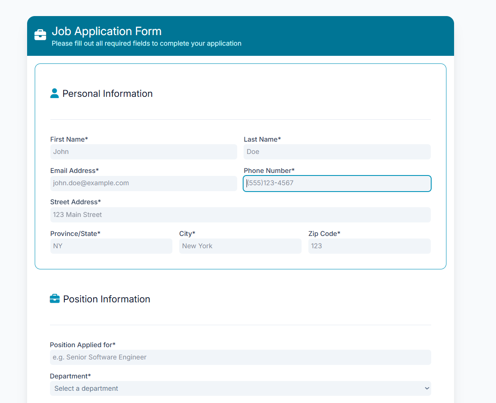

## Form Craft v1.0.0


A clean, responsive, and accessible job application form built with HTML, Tailwind CSS, and JavaScript.


## 🔗 Live Demo

https://zohreh-pdr.github.io/formcraft-ui


##  Screenshots




## Features

- Responsive Design – Works on mobile, tablet, and desktop.

- Tailwind CSS Styling – Utilizes utility-first classes with custom components.

- Form Validation – Built-in HTML validation enhanced with JavaScript.

- Includes ARIA roles and live feedback for screen readers.

- Interactive UI Feedback

- Highlights invalid fields in red.

- Focuses on the first invalid input automatically.

- Shows success message on valid submission.

- Reusable Components – Organized structure for sections like Personal Info, Work Experience, Education, Skills, and References.

- Lightweight – No frameworks required; pure HTML, CSS, and JS.


##  Technologies Used

- Tailwind CSS
- Vanilla JavaScript
- HTML5 & CSS3
- Font Awesome Icons


##  Installation / Usage


If you want to run it locally:
Clone the repository:
```bash
git clone https://github.com/zohreh-pdr/formcraft-ui.git
```
Open index.html in your browser.


##  License

This project is licensed under the **MIT License** — feel free to use, modify, and learn from it.


##  Contributing
Contributions are welcome! Please open an issue or submit a pull request.


##  👩‍💻 Author

**Zohre Padarloo**  
Junior Frontend Developer
[GitHub](https://github.com/zohreh-pdr)
